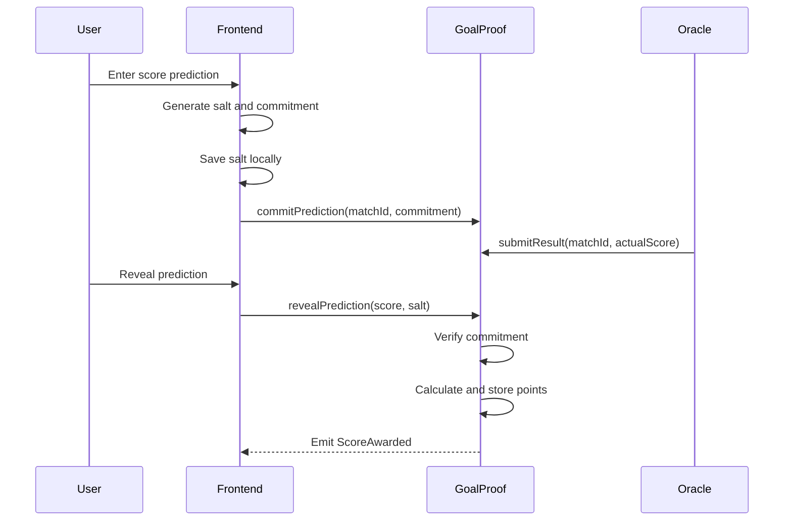

# GoalProof Development Specification

> **Project:** GoalProof — A Commit–Reveal Prediction League for the World Cup  
> **Document type:** Product requirements + technical design + implementation plan  
> **Primary audience:** Codex / software engineering team  
> **Target:** A complete, testable classroom MVP within 2–3 weeks  
> **Last updated:** 2026-06-24

---

## 0. Instructions to the Coding Agent

Implement this project as a working vertical slice, not as a collection of disconnected mock pages.

### Execution priorities

1. Make the smart-contract lifecycle work locally end to end.
2. Write and pass the complete contract test suite.
3. Build the frontend around the tested contract ABI.
4. Add a deterministic demo seed script.
5. Add testnet deployment only after the local demo is stable.
6. Treat the badge/NFT module as an extension; do not let it block the core MVP.

### Non-negotiable rules

- Do not implement real-money betting, odds, deposits, prize pools, or token wagering.
- Do not add a backend database to the MVP.
- Do not use an upgradeable proxy.
- Do not depend on a live sports API for the main demo.
- Do not perform leaderboard sorting in Solidity.
- Do not store user salts on-chain.
- Do not use `abi.encodePacked` for the prediction commitment.
- Do not continue to the next milestone while tests for the current milestone are failing.
- Pin dependency versions in the lockfile.
- Never commit `.env`, private keys, RPC secrets, or locally generated salts.
- Prefer clear, auditable code over abstraction-heavy code.
- When installed library APIs differ from examples in this document, follow the installed version's official API and record the deviation in `DECISIONS.md`.

### Required completion report

At the end, produce:

- implemented features;
- test count and test result;
- local run instructions;
- testnet address, if deployed;
- known limitations;
- screenshots or demo-video checklist;
- any deviations from this specification.

---

# 1. Product Summary

GoalProof is a blockchain-based football prediction reputation application.

A user commits a hidden prediction before a match deadline. The user later reveals the original score prediction and a secret salt. The smart contract verifies that the revealed prediction matches the pre-deadline commitment, calculates points using transparent rules, and records the result on-chain.

The system demonstrates four blockchain concepts:

1. immutable time-stamped commitments;
2. commit–reveal privacy;
3. role-based oracle input;
4. deterministic smart-contract settlement.

## 1.1 Product statement

> GoalProof proves that a football prediction existed before kickoff without publicly revealing the prediction in advance or trusting a centralized organizer.

## 1.2 MVP user story

1. An administrator creates four demo matches.
2. Alice connects a wallet and commits a prediction before the deadline.
3. Bob commits a different prediction.
4. The deadline passes.
5. An oracle account submits the final match result.
6. Alice and Bob reveal their predictions.
7. The contract verifies each commitment and awards points.
8. The frontend displays prediction histories and a leaderboard reconstructed from contract events.

## 1.3 Out of scope

The following must not be implemented in the MVP:

- real ETH or token stakes;
- betting odds;
- automated market makers;
- prize pools;
- fiat payments;
- DAO governance;
- cross-chain deployment;
- live mainnet deployment;
- full tournament coverage;
- live sports API dependency;
- personal identity verification;
- user-to-user transfers;
- production-grade decentralized oracle infrastructure.

---

# 2. Success Criteria

The MVP is complete only when all of the following are true.

## 2.1 Functional acceptance criteria

- A match manager can create a match.
- A normal wallet cannot create a match.
- A user can commit exactly one prediction for a match before the commit deadline.
- The commitment does not reveal the predicted score.
- A user cannot commit after the deadline.
- An oracle can submit a result after kickoff.
- A normal wallet cannot submit a result.
- A user can reveal only after a result has been submitted.
- A reveal succeeds only when the score and salt reproduce the original commitment.
- Exact score awards 5 points.
- Correct outcome awards 3 points.
- Incorrect outcome awards 0 points.
- A prediction can be revealed and scored only once.
- Total user score is stored on-chain.
- The frontend locally preserves the salt required for reveal.
- The frontend clearly warns the user that losing the salt makes reveal impossible.
- The frontend displays transaction states and readable errors.
- The leaderboard is derived off-chain from events.
- A deterministic local demo can be run without Internet access after dependencies are installed.

## 2.2 Engineering acceptance criteria

- All required tests pass.
- Contract code has NatSpec comments on external/public functions.
- Custom Solidity errors are used instead of long revert strings.
- Role assignments are tested.
- Deadline boundaries are tested.
- Commitment calculation has a shared test vector between Solidity and TypeScript.
- Lint and TypeScript checks pass.
- A production frontend build succeeds.
- No secrets are committed.
- `README.md` contains one-command or minimal-step setup instructions.
- `DECISIONS.md` records meaningful deviations and trade-offs.

## 2.3 Presentation acceptance criteria

The demo must show:

1. admin creates or loads a match;
2. two wallets submit hidden commitments;
3. the chain stores only commitment hashes;
4. time advances beyond kickoff;
5. oracle submits the result;
6. users reveal;
7. one exact-score and one outcome-only score are demonstrated;
8. leaderboard updates;
9. all automated tests pass;
10. gas usage for the main write functions is shown.

---

# 3. Recommended Technology Stack

Use current stable releases at implementation time and pin the resolved versions.

## 3.1 Runtime and package manager

- Node.js: `>= 22.13.0`
- Package manager: `pnpm`
- Language: TypeScript
- Repository: single Git repository

## 3.2 Smart contracts

- Solidity: `^0.8.24` or a newer compiler supported by the chosen OpenZeppelin release
- Hardhat 3
- OpenZeppelin Contracts 5.x stable audited release
- Hardhat Ignition for deployment
- TypeScript integration tests
- Local Hardhat network
- Sepolia as optional public testnet

## 3.3 Frontend

- Vite
- React
- TypeScript
- wagmi
- viem
- TanStack Query through wagmi
- React Router
- Plain CSS, CSS modules, or a lightweight styling solution
- No backend

## 3.4 Quality tooling

- ESLint
- Prettier
- Solidity formatting/linting supported by the selected setup
- GitHub Actions optional but recommended
- Contract coverage
- Gas snapshot generated from transaction receipts

---

# 4. Repository Structure

Use this structure unless the installed Hardhat template requires a small variation.

```text
goalproof/
├─ contracts/
│  ├─ GoalProof.sol
│  └─ GoalProofBadge.sol                 # optional Phase 2 extension
├─ test/
│  ├─ GoalProof.access.test.ts
│  ├─ GoalProof.match.test.ts
│  ├─ GoalProof.commit.test.ts
│  ├─ GoalProof.result.test.ts
│  ├─ GoalProof.reveal.test.ts
│  ├─ GoalProof.scoring.test.ts
│  ├─ GoalProof.pause.test.ts
│  └─ GoalProof.integration.test.ts
├─ ignition/
│  └─ modules/
│     ├─ GoalProof.ts
│     └─ GoalProofWithBadge.ts           # optional
├─ scripts/
│  ├─ seed-demo.ts
│  ├─ demo-flow.ts
│  ├─ export-abi.ts
│  └─ gas-snapshot.ts
├─ frontend/
│  ├─ src/
│  │  ├─ abi/
│  │  │  ├─ GoalProof.json
│  │  │  └─ deployment.ts
│  │  ├─ components/
│  │  ├─ hooks/
│  │  ├─ lib/
│  │  │  ├─ commitment.ts
│  │  │  ├─ saltStorage.ts
│  │  │  ├─ errors.ts
│  │  │  └─ format.ts
│  │  ├─ pages/
│  │  │  ├─ HomePage.tsx
│  │  │  ├─ MatchesPage.tsx
│  │  │  ├─ MatchDetailPage.tsx
│  │  │  ├─ LeaderboardPage.tsx
│  │  │  ├─ ProfilePage.tsx
│  │  │  └─ AdminPage.tsx
│  │  ├─ config/
│  │  │  └─ wagmi.ts
│  │  ├─ App.tsx
│  │  └─ main.tsx
│  ├─ .env.example
│  ├─ package.json
│  └─ vite.config.ts
├─ shared/
│  ├─ demoMatches.ts
│  └─ scoring.ts
├─ docs/
│  ├─ ARCHITECTURE.md
│  ├─ DEMO_SCRIPT.md
│  ├─ SECURITY.md
│  └─ TEST_PLAN.md
├─ deployments/
│  ├─ localhost.json
│  └─ sepolia.json
├─ .env.example
├─ .gitignore
├─ DECISIONS.md
├─ README.md
├─ hardhat.config.ts
├─ package.json
├─ pnpm-workspace.yaml
└─ pnpm-lock.yaml
```

---

# 5. Smart-Contract Design

## 5.1 Core design principles

- The core contract must not receive or transfer ETH.
- The core contract should make no external calls in the MVP.
- Match IDs are sequential and start at 1.
- Team names are display metadata, not trusted identifiers.
- Time rules are enforced in Solidity, not only in the frontend.
- A prediction is committed once and cannot be edited.
- A valid reveal calculates and awards points in the same transaction.
- Match and scoring data are authoritative on-chain.
- Leaderboard ordering is off-chain.
- Match results are entered by an authorized oracle role.
- The contract is pausable for emergency demonstration and security discussion.

## 5.2 Roles

Use OpenZeppelin `AccessControl`.

```solidity
bytes32 public constant MATCH_MANAGER_ROLE = keccak256("MATCH_MANAGER_ROLE");
bytes32 public constant ORACLE_ROLE = keccak256("ORACLE_ROLE");
bytes32 public constant PAUSER_ROLE = keccak256("PAUSER_ROLE");
```

On deployment:

- deployer receives `DEFAULT_ADMIN_ROLE`;
- deployer receives `MATCH_MANAGER_ROLE`;
- deployer receives `ORACLE_ROLE`;
- deployer receives `PAUSER_ROLE`.

The deployment script must support granting the oracle role to a separate demo account.

## 5.3 Constants

```solidity
uint8 public constant EXACT_SCORE_POINTS = 5;
uint8 public constant CORRECT_OUTCOME_POINTS = 3;
uint8 public constant WRONG_POINTS = 0;
uint8 public constant MAX_ALLOWED_SCORE = 30;
```

## 5.4 Data structures

Recommended structure:

```solidity
struct MatchData {
    string homeTeam;
    string awayTeam;
    uint64 kickoffTime;
    uint64 commitDeadline;
    uint64 revealDeadline;
    uint8 actualHomeScore;
    uint8 actualAwayScore;
    bool resultSubmitted;
    bool canceled;
    uint32 revealCount;
}

struct Prediction {
    bytes32 commitment;
    uint64 committedAt;
    uint64 revealedAt;
    uint8 predictedHomeScore;
    uint8 predictedAwayScore;
    uint8 pointsAwarded;
    bool revealed;
}
```

Storage:

```solidity
uint256 public matchCount;

mapping(uint256 matchId => MatchData matchData) private _matches;

mapping(uint256 matchId => mapping(address user => Prediction prediction))
    private _predictions;

mapping(address user => uint256 totalScore) public totalScores;

mapping(address user => uint256 validRevealCount) public validRevealCounts;

mapping(address user => uint256 exactScoreCount) public exactScoreCounts;
```

Do not maintain a dynamic array of all users solely for leaderboard sorting.

## 5.5 Match timing constraints

On match creation enforce:

```text
commitDeadline > current block timestamp
kickoffTime >= commitDeadline
revealDeadline > kickoffTime
```

Recommended demo timing:

```text
commitDeadline = now + 5 minutes
kickoffTime     = now + 6 minutes
revealDeadline  = now + 30 minutes
```

For automated tests, use time helpers rather than waiting.

## 5.6 Commitment algorithm

Use domain separation to prevent accidental reuse across contracts or chains.

Canonical Solidity computation:

```solidity
function computeCommitment(
    address user,
    uint256 matchId,
    uint8 predictedHomeScore,
    uint8 predictedAwayScore,
    bytes32 salt
) public view returns (bytes32) {
    return keccak256(
        abi.encode(
            block.chainid,
            address(this),
            user,
            matchId,
            predictedHomeScore,
            predictedAwayScore,
            salt
        )
    );
}
```

The frontend must reproduce this exact encoding with viem's ABI encoding utilities.

Do not use `abi.encodePacked`.

### Salt generation

Generate a cryptographically random 32-byte salt in the browser:

```ts
crypto.getRandomValues(new Uint8Array(32));
```

Convert it to a `0x`-prefixed `bytes32` hex string.

The salt must be saved locally before the wallet transaction is submitted.

## 5.7 Public/external interface

The final exact signatures may be adjusted for compiler or framework conventions, but behavior must remain equivalent.

```solidity
constructor(address admin);

function createMatch(
    string calldata homeTeam,
    string calldata awayTeam,
    uint64 kickoffTime,
    uint64 commitDeadline,
    uint64 revealDeadline
) external onlyRole(MATCH_MANAGER_ROLE) returns (uint256 matchId);

function cancelMatch(
    uint256 matchId
) external onlyRole(MATCH_MANAGER_ROLE);

function commitPrediction(
    uint256 matchId,
    bytes32 commitment
) external whenNotPaused;

function submitResult(
    uint256 matchId,
    uint8 actualHomeScore,
    uint8 actualAwayScore
) external onlyRole(ORACLE_ROLE) whenNotPaused;

function revealPrediction(
    uint256 matchId,
    uint8 predictedHomeScore,
    uint8 predictedAwayScore,
    bytes32 salt
) external whenNotPaused returns (uint8 pointsAwarded);

function computeCommitment(
    address user,
    uint256 matchId,
    uint8 predictedHomeScore,
    uint8 predictedAwayScore,
    bytes32 salt
) public view returns (bytes32);

function calculatePoints(
    uint8 predictedHomeScore,
    uint8 predictedAwayScore,
    uint8 actualHomeScore,
    uint8 actualAwayScore
) public pure returns (uint8);

function getMatch(
    uint256 matchId
) external view returns (MatchData memory);

function getPrediction(
    uint256 matchId,
    address user
) external view returns (Prediction memory);

function pause() external onlyRole(PAUSER_ROLE);

function unpause() external onlyRole(PAUSER_ROLE);
```

## 5.8 State transition rules

### Create match

Allowed only when:

- caller has `MATCH_MANAGER_ROLE`;
- team strings are non-empty;
- team strings are not identical;
- time ordering is valid.

Effects:

- increment `matchCount`;
- store match data;
- emit `MatchCreated`.

### Commit prediction

Allowed only when:

- contract is not paused;
- match exists;
- match is not canceled;
- current time is strictly before or equal to the selected boundary rule;
- choose one exact policy and use it consistently:
  - recommended: `block.timestamp < commitDeadline`;
- commitment is non-zero;
- caller has not committed previously.

Effects:

- store commitment;
- store `committedAt`;
- emit `PredictionCommitted`.

Do not store predicted scores or salt.

### Submit result

Allowed only when:

- caller has `ORACLE_ROLE`;
- contract is not paused;
- match exists;
- match is not canceled;
- current time is greater than or equal to kickoff;
- result has not already been submitted;
- each score is at most `MAX_ALLOWED_SCORE`.

Effects:

- store actual scores;
- set `resultSubmitted`;
- emit `ResultSubmitted`.

### Reveal prediction

Allowed only when:

- contract is not paused;
- match exists;
- match is not canceled;
- result has been submitted;
- current time is at or before reveal deadline;
- caller committed;
- caller has not revealed;
- predicted scores are within the maximum;
- computed commitment matches stored commitment.

Effects:

1. calculate points;
2. store revealed scores;
3. store reveal time;
4. store awarded points;
5. mark revealed;
6. increment match reveal count;
7. increment user reveal count;
8. increment exact-score count when applicable;
9. increase total score;
10. emit `PredictionRevealed`;
11. emit `ScoreAwarded`.

No separate `claimPoints` transaction is required.

### Cancel match

Allowed only when:

- caller has match-manager role;
- match exists;
- match is not already canceled;
- no result has been submitted.

Effects:

- mark canceled;
- emit `MatchCanceled`.

Committed predictions for a canceled match remain visible as commitments but cannot be revealed or scored.

## 5.9 Scoring algorithm

Outcome categories:

```text
HOME_WIN
DRAW
AWAY_WIN
```

Rules:

```text
exact predicted score == actual score → 5 points
same match outcome                    → 3 points
otherwise                             → 0 points
```

Examples:

| Actual | Predicted | Points |
| ------ | --------- | -----: |
| 2–0    | 2–0       |      5 |
| 2–0    | 3–1       |      3 |
| 2–0    | 1–1       |      0 |
| 1–1    | 0–0       |      3 |
| 1–1    | 1–1       |      5 |
| 0–2    | 1–3       |      3 |

Implement the algorithm as a pure function and test it independently.

## 5.10 Events

```solidity
event MatchCreated(
    uint256 indexed matchId,
    string homeTeam,
    string awayTeam,
    uint64 kickoffTime,
    uint64 commitDeadline,
    uint64 revealDeadline
);

event MatchCanceled(uint256 indexed matchId);

event PredictionCommitted(
    uint256 indexed matchId,
    address indexed user,
    bytes32 commitment,
    uint64 committedAt
);

event ResultSubmitted(
    uint256 indexed matchId,
    uint8 actualHomeScore,
    uint8 actualAwayScore,
    address indexed oracle
);

event PredictionRevealed(
    uint256 indexed matchId,
    address indexed user,
    uint8 predictedHomeScore,
    uint8 predictedAwayScore,
    uint8 pointsAwarded
);

event ScoreAwarded(
    address indexed user,
    uint256 indexed matchId,
    uint8 points,
    uint256 newTotalScore
);
```

Events are part of the frontend indexing contract. Do not rename them after frontend integration without updating the ABI and event parser.

## 5.11 Custom errors

Use custom errors similar to:

```solidity
error InvalidMatchId(uint256 matchId);
error EmptyTeamName();
error IdenticalTeams();
error InvalidTimeConfiguration();
error MatchCanceledError(uint256 matchId);
error CommitPeriodClosed(uint256 matchId);
error PredictionAlreadyCommitted(uint256 matchId, address user);
error ZeroCommitment();
error MatchNotStarted(uint256 matchId);
error ResultAlreadySubmitted(uint256 matchId);
error ResultNotSubmitted(uint256 matchId);
error RevealPeriodClosed(uint256 matchId);
error PredictionNotCommitted(uint256 matchId, address user);
error PredictionAlreadyRevealed(uint256 matchId, address user);
error CommitmentMismatch();
error ScoreOutOfRange(uint8 score);
```

The frontend must map common errors to readable messages.

## 5.12 Boundary policy

Document and test exact timestamp behavior.

Recommended policy:

```text
commit allowed:        block.timestamp < commitDeadline
result allowed:        block.timestamp >= kickoffTime
reveal allowed:        resultSubmitted && block.timestamp <= revealDeadline
```

Tests must include timestamps exactly one second before, exactly equal to, and one second after each boundary.

---

# 6. Optional Phase 2: Achievement Badge Contract

Do not start this phase until the core contract and frontend vertical slice pass all tests.

## 6.1 Purpose

Provide non-transferable ERC-1155 achievement badges for prediction reputation.

Suggested IDs:

```text
1 = FIRST_REVEAL
2 = FIRST_EXACT_SCORE
3 = TEN_POINTS
4 = TWENTY_POINTS
```

## 6.2 Requirements

- Use OpenZeppelin ERC-1155.
- Use role-based mint authorization.
- Grant the core GoalProof contract the minter role.
- Prevent wallet-to-wallet transfer; badges are soulbound.
- Mint each badge at most once per wallet.
- Badge mint failure must be considered carefully:
  - recommended for the course project: make badge minting a separate user-triggered claim so badge failure cannot block prediction scoring;
  - do not make core score settlement depend on an external badge call.

## 6.3 Optional badge interface

```solidity
function claimEligibleBadge(uint256 badgeId) external;
function isEligible(address user, uint256 badgeId) external view returns (bool);
function hasBadge(address user, uint256 badgeId) external view returns (bool);
```

A simpler alternative is to keep badge eligibility in the frontend and use admin minting for the presentation. Record the trade-off if this route is chosen.

---

# 7. Frontend Product Requirements

## 7.1 General UX

The interface should look like a lightweight sports application, not a developer console.

Required global elements:

- application name and one-sentence explanation;
- connected wallet address;
- network indicator;
- connect/disconnect action;
- navigation;
- transaction progress feedback;
- wrong-network warning;
- readable errors;
- no raw JSON in normal user flows.

## 7.2 Required pages

### Home page

Display:

- product statement;
- three-step explanation: Commit → Result → Reveal;
- current network;
- featured active matches;
- link to methodology.

### Matches page

Display all matches from `1..matchCount`.

Each match card shows:

- home and away teams;
- kickoff time;
- current phase;
- countdown;
- whether the user has committed;
- whether result is available;
- whether the user has revealed;
- points earned, if revealed.

Computed frontend phases:

```text
CANCELED
COMMIT_OPEN
WAITING_FOR_KICKOFF
WAITING_FOR_RESULT
REVEAL_OPEN
REVEAL_CLOSED
COMPLETED
```

### Match detail page

Before commit:

- predicted home score input;
- predicted away score input;
- explanation that the visible transaction contains only a hash;
- commit button.

After generating salt:

- save salt in local storage before sending transaction;
- optionally allow exporting a small recovery JSON file;
- show a strong warning not to clear browser storage.

After commit:

- show commitment hash;
- show transaction hash;
- show committed timestamp;
- do not display predicted score publicly unless it exists only in local private storage.

After result:

- show actual result;
- load locally stored score and salt;
- reveal button;
- allow manual entry of score and salt as recovery path;
- show awarded points after confirmation.

### Leaderboard page

Reconstruct scores from `ScoreAwarded` events.

Display:

- rank;
- shortened wallet address;
- total score;
- number of scored matches;
- exact-score count if reconstructed or read from contract;
- link to profile.

Rules:

- aggregate events by wallet;
- sort in the browser;
- use deterministic tie-breaking:
  1. higher total score;
  2. more exact scores;
  3. earlier first scored event;
  4. lexicographic wallet address.

For a small classroom dataset, querying all events from deployment block is acceptable.

### Profile page

Display:

- wallet address;
- total on-chain score;
- valid reveal count;
- exact score count;
- committed predictions;
- revealed predictions;
- missing-salt warnings;
- badges if Phase 2 is implemented.

### Admin page

Only show actions when the connected wallet has the required role.

Tabs:

1. Create match
2. Submit result
3. Cancel match
4. Pause/unpause
5. Role diagnostics

The UI is not a security boundary. Contracts must enforce every permission.

## 7.3 Wallet and chain configuration

Support:

- Hardhat localhost;
- Sepolia.

Environment variables:

```bash
VITE_CHAIN_ID=
VITE_RPC_URL=
VITE_GOALPROOF_ADDRESS=
VITE_DEPLOYMENT_BLOCK=
```

Do not place private keys in frontend environment variables.

## 7.4 Salt storage

Create a dedicated module.

Recommended key:

```text
goalproof:{chainId}:{contractAddress}:{walletAddress}:{matchId}
```

Stored value:

```ts
type StoredPredictionSecret = {
  version: 1;
  matchId: string;
  walletAddress: `0x${string}`;
  predictedHomeScore: number;
  predictedAwayScore: number;
  salt: `0x${string}`;
  commitment: `0x${string}`;
  createdAt: string;
  transactionHash?: `0x${string}`;
};
```

Required behaviors:

- write before sending commit transaction;
- update with transaction hash after submission;
- validate wallet, chain, contract, and match before reveal;
- support deletion after successful reveal only after asking the user;
- support export/import recovery JSON;
- never send the salt to analytics or logs;
- never store the private key.

## 7.5 Commitment helper

Implement one canonical helper:

```ts
computePredictionCommitment({
  chainId,
  contractAddress,
  userAddress,
  matchId,
  predictedHomeScore,
  predictedAwayScore,
  salt,
}): Hex
```

Use viem ABI encoding and keccak256.

Create a test vector and verify that:

```text
frontend TypeScript result == Solidity computeCommitment result
```

This is a critical cross-layer test.

## 7.6 Transaction UX

Each write action must show:

```text
Awaiting wallet signature
Submitted
Waiting for confirmation
Confirmed
Failed
```

Disable duplicate submissions while a transaction is pending.

After confirmation:

- invalidate relevant queries;
- refetch match and prediction state;
- show transaction hash;
- show human-readable success.

## 7.7 Error handling

Map known custom errors to messages such as:

```text
CommitPeriodClosed → The prediction deadline has passed.
PredictionAlreadyCommitted → This wallet has already committed for this match.
CommitmentMismatch → The score or recovery salt does not match the original commitment.
ResultNotSubmitted → The oracle has not submitted the match result yet.
RevealPeriodClosed → The reveal deadline has passed.
AccessControlUnauthorizedAccount → This wallet is not authorized for this action.
```

Show the raw error in a collapsible technical-details section.

---

# 8. Demo Data and Deterministic Demo Flow

Do not use a live match as the only demo path.

## 8.1 Demo matches

Create four clearly labeled simulated matches:

```text
Demo Match 1: BRA vs ARG
Demo Match 2: FRA vs ESP
Demo Match 3: GER vs NED
Demo Match 4: JPN vs KOR
```

The application may call them “Demo fixtures.” Do not claim they are official tournament fixtures.

## 8.2 Demo accounts

Use at least:

- admin/match manager;
- oracle;
- Alice;
- Bob;
- optional Charlie.

## 8.3 Demo predictions

Use deterministic examples:

```text
Actual result: 2–0

Alice predicts 2–0 → 5 points
Bob predicts 3–1   → 3 points
Charlie predicts 1–1 → 0 points
```

## 8.4 Demo script requirements

`scripts/demo-flow.ts` must be capable of:

1. deploying or reading local deployment;
2. creating a match;
3. generating deterministic salts from fixed test values;
4. committing from multiple accounts;
5. advancing local time;
6. submitting the result;
7. revealing predictions;
8. printing points and totals;
9. printing gas used;
10. exiting with non-zero status on any failed assertion.

The browser demo should use random salts; the CLI demo may use deterministic salts for reproducibility.

---

# 9. Testing Specification

Use isolated fixtures where possible.

## 9.1 Access-control tests

- deployer has all expected roles;
- unauthorized wallet cannot create match;
- unauthorized wallet cannot submit result;
- unauthorized wallet cannot pause;
- admin can grant oracle role;
- granted oracle can submit result;
- revoked oracle can no longer submit result.

## 9.2 Match creation tests

- creates valid match;
- increments match count;
- emits correct event;
- rejects empty home team;
- rejects empty away team;
- rejects identical teams;
- rejects expired commit deadline;
- rejects commit deadline after kickoff;
- rejects reveal deadline at or before kickoff;
- retrieves complete match data;
- cancels a valid unresolved match;
- rejects canceling resolved match;
- rejects double cancel.

## 9.3 Commit tests

- commits before deadline;
- stores only hash and timestamp;
- emits event;
- rejects zero commitment;
- rejects invalid match;
- rejects canceled match;
- rejects duplicate commit;
- rejects commit exactly at deadline under the selected policy;
- rejects commit after deadline;
- rejects commit while paused;
- accepts different users for the same match.

## 9.4 Result tests

- oracle submits after kickoff;
- emits result event;
- rejects before kickoff;
- rejects duplicate result;
- rejects unauthorized caller;
- rejects invalid match;
- rejects canceled match;
- rejects score above maximum;
- rejects while paused.

## 9.5 Reveal tests

- valid reveal succeeds;
- exact commitment verification succeeds;
- stores revealed scores;
- stores awarded points;
- updates total score;
- increments counters;
- emits reveal and score events;
- rejects reveal before result;
- rejects reveal without commit;
- rejects wrong salt;
- rejects wrong score;
- rejects wrong wallet attempting to reveal copied data;
- rejects duplicate reveal;
- rejects reveal after deadline;
- rejects canceled match;
- rejects while paused.

## 9.6 Scoring tests

At minimum:

- exact home win;
- correct but non-exact home win;
- wrong home-win prediction;
- exact draw;
- correct but non-exact draw;
- exact away win;
- correct but non-exact away win;
- zero-zero result;
- maximum allowed score boundary.

Consider table-driven tests.

## 9.7 Commitment test vector

Create one fixed vector:

```text
chainId
contract address
user address
matchId
home score
away score
salt
expected commitment
```

Test the expected commitment:

- in Solidity;
- in TypeScript;
- in the frontend helper.

## 9.8 Integration test

A single full-flow test must:

1. deploy;
2. create one match;
3. commit for Alice and Bob;
4. advance time;
5. submit 2–0 result;
6. reveal Alice 2–0;
7. reveal Bob 3–1;
8. assert Alice total = 5;
9. assert Bob total = 3;
10. assert event data;
11. assert duplicate reveal fails.

## 9.9 Frontend tests

At minimum test pure modules:

- salt generation format;
- storage key generation;
- save/read/import/export salt record;
- commitment calculation;
- phase calculation;
- score/outcome formatting;
- custom-error mapping;
- leaderboard aggregation and tie-breaking.

Component tests are recommended for:

- commit form validation;
- reveal missing-salt warning;
- transaction status display.

## 9.10 Required commands

Adapt names to the generated project, but provide equivalent scripts:

```bash
pnpm install
pnpm contracts:compile
pnpm contracts:test
pnpm contracts:coverage
pnpm contracts:gas
pnpm frontend:typecheck
pnpm frontend:lint
pnpm frontend:test
pnpm frontend:build
pnpm check
```

`pnpm check` must run all critical checks.

---

# 10. Security Requirements

Create `docs/SECURITY.md` with a concise threat model.

## 10.1 Threats addressed

- late prediction submission;
- post-result prediction modification;
- copying visible predictions;
- unauthorized result submission;
- double reveal;
- duplicate scoring;
- malformed scores;
- accidental emergency continuation;
- cross-chain or cross-contract commitment reuse;
- frontend bypass.

## 10.2 Known trust assumptions

- the oracle account is trusted to submit the correct real-world result;
- the admin controls role assignment;
- users are responsible for preserving salts;
- block timestamps can have limited validator variation;
- the frontend event query assumes a correct deployment block;
- local storage is not secure against a compromised browser.

## 10.3 Required safeguards

- role checks in Solidity;
- pause mechanism;
- no payable functions;
- no arbitrary external calls;
- no unbounded loops over users;
- no on-chain leaderboard sorting;
- domain-separated commitment;
- exact time-boundary tests;
- no secrets in Git;
- clear oracle centralization disclosure;
- use installed OpenZeppelin packages rather than copied library source.

## 10.4 Static review checklist

Before final delivery, manually inspect:

- role administration hierarchy;
- timestamp comparisons;
- commitment encoding order and types;
- integer type conversions;
- event indexing;
- canceled-match behavior;
- result-submission immutability;
- reveal deadline;
- duplicate score prevention;
- public getters and privacy expectations.

---

# 11. Deployment Specification

## 11.1 Local deployment

Required first.

Commands should provide this workflow:

```bash
pnpm install
pnpm hardhat node
pnpm deploy:localhost
pnpm seed:localhost
pnpm dev
```

Save deployment metadata:

```json
{
  "chainId": 31337,
  "contractAddress": "0x...",
  "deploymentBlock": 1,
  "deployer": "0x...",
  "oracle": "0x...",
  "deployedAt": "ISO-8601 timestamp"
}
```

Copy or generate the ABI and deployment configuration used by the frontend.

## 11.2 Sepolia deployment

Optional but strongly recommended after local stability.

Root `.env.example`:

```bash
SEPOLIA_RPC_URL=
DEPLOYER_PRIVATE_KEY=
ORACLE_ADDRESS=
ETHERSCAN_API_KEY=
```

Requirements:

- fail fast when variables are missing;
- never print private keys;
- verify the configured chain ID before deployment;
- record contract address and deployment block;
- optionally verify source code;
- grant roles in deployment or post-deployment script;
- document faucet and RPC setup generically, without hardcoding a commercial provider.

## 11.3 Contract verification

If verification tooling is configured, add:

```bash
pnpm verify:sepolia
```

Verification is desirable but not a blocker for the local MVP.

---

# 12. Milestone Plan

## Milestone 0 — Repository bootstrap

Deliverables:

- Git repository;
- Hardhat 3 TypeScript project;
- React/Vite TypeScript frontend;
- pnpm workspace;
- formatting and lint scripts;
- `.env.example`;
- README skeleton;
- first successful empty compile and frontend build.

Exit condition:

```text
pnpm install && pnpm check
```

succeeds for the scaffold.

## Milestone 1 — Core match and role contract

Deliverables:

- roles;
- match creation;
- match retrieval;
- match cancelation;
- events;
- custom errors;
- access and match tests.

Exit condition:

- all Milestone 1 tests pass.

## Milestone 2 — Commit–reveal and scoring

Deliverables:

- commitment helper;
- commit;
- oracle result submission;
- reveal;
- scoring;
- total scores and counters;
- pause/unpause;
- complete unit and integration tests.

Exit condition:

- full contract test suite passes;
- coverage report generated;
- demo-flow CLI succeeds.

## Milestone 3 — Frontend vertical slice

Deliverables:

- wallet connection;
- match list;
- match details;
- commit form;
- local salt persistence;
- result display;
- reveal form;
- transaction feedback;
- error mapping.

Exit condition:

- Alice can complete the entire flow in the browser against localhost.

## Milestone 4 — Leaderboard and admin tools

Deliverables:

- event-based leaderboard;
- profile page;
- admin create-match form;
- oracle submit-result form;
- pause controls;
- deterministic demo seed.

Exit condition:

- two-wallet demo works and leaderboard updates correctly.

## Milestone 5 — Presentation hardening

Deliverables:

- gas snapshot;
- test summary;
- architecture document;
- security document;
- demo script;
- clean README;
- optional Sepolia deployment;
- optional badges.

Exit condition:

- a new developer can clone and run the project using only the README;
- the presentation demo can be performed without code changes.

---

# 13. Definition of Done

The project is done when:

```text
[ ] Repository installs from a clean clone
[ ] Contracts compile
[ ] All contract tests pass
[ ] Coverage report is generated
[ ] Frontend TypeScript check passes
[ ] Frontend lint passes
[ ] Frontend tests pass
[ ] Frontend production build passes
[ ] Local deployment works
[ ] Demo seed works
[ ] Full CLI demo works
[ ] Browser commit–reveal flow works
[ ] Two users appear correctly on leaderboard
[ ] Admin and oracle permissions are demonstrated
[ ] Salt export/import recovery works
[ ] README contains exact setup commands
[ ] SECURITY.md lists oracle and salt-storage limitations
[ ] DEMO_SCRIPT.md supports a 3–5 minute recorded demo
[ ] No secrets are committed
[ ] Optional functionality does not break MVP
```

---

# 14. README Requirements

The final README must include:

1. project summary;
2. why blockchain is necessary;
3. architecture diagram;
4. commit–reveal explanation;
5. technology stack;
6. prerequisites;
7. installation;
8. local node startup;
9. deployment;
10. demo seed;
11. frontend startup;
12. tests;
13. environment variables;
14. contract addresses;
15. scoring rules;
16. threat model summary;
17. known limitations;
18. future improvements;
19. team roles.

Use a Mermaid sequence diagram:



---

# 15. Presentation Demo Script Requirements

Create `docs/DEMO_SCRIPT.md` for a stable 3–5 minute recording.

Suggested sequence:

### Scene 1 — Problem

Show that a normal public prediction leaks the answer, while a private centralized record requires trust.

### Scene 2 — Commit

- Alice enters 2–0.
- Browser generates salt.
- Wallet submits transaction.
- Block explorer or contract UI shows only a `bytes32` commitment.

### Scene 3 — Second participant

- Bob enters 3–1.
- Show different commitment.

### Scene 4 — Oracle

- Switch to oracle wallet.
- Submit actual result 2–0.
- Explain oracle trust assumption.

### Scene 5 — Reveal and settlement

- Alice reveals and gets 5.
- Bob reveals and gets 3.
- Attempt an incorrect reveal or show a test proving it reverts.

### Scene 6 — Leaderboard and tests

- Show leaderboard.
- Show passing tests.
- Show gas snapshot.
- Close with limitations and future decentralized-oracle design.

---

# 16. Gas Snapshot

Record gas used by:

- `createMatch`;
- `commitPrediction`;
- `submitResult`;
- `revealPrediction`.

Generate `docs/gas-report.json` or `docs/GAS.md`.

The report should include:

```text
function
gas used
test environment
compiler version
optimizer settings
date
```

Do not claim gas costs are production estimates without qualification.

---

# 17. Decision Log

Create `DECISIONS.md`.

Initial decisions:

## D-001 — No real-money staking

Reason: avoids financial-security and legal complexity while preserving the core blockchain learning objectives.

## D-002 — Authorized oracle for MVP

Reason: allows a complete deterministic demonstration. Decentralized oracle design is documented as future work.

## D-003 — Automatic scoring during reveal

Reason: reduces one wallet transaction and prevents unclaimed valid scores.

## D-004 — Leaderboard derived from events

Reason: on-chain sorting is gas-inefficient and unnecessary for a small classroom dataset.

## D-005 — Local salt storage plus export/import

Reason: the salt must remain private but users need a recovery path.

## D-006 — No upgradeable proxy

Reason: deployment simplicity and reduced attack surface are more valuable than upgradeability for a short-lived course project.

## D-007 — Badges are non-blocking Phase 2

Reason: ERC-1155 integration should not jeopardize the core commit–reveal demo.

---

# 18. Suggested Root Scripts

Adapt to the generated Hardhat and Vite setup.

```json
{
  "scripts": {
    "contracts:compile": "hardhat compile",
    "contracts:test": "hardhat test",
    "contracts:coverage": "hardhat test --coverage",
    "contracts:gas": "hardhat run scripts/gas-snapshot.ts",
    "node": "hardhat node",
    "deploy:localhost": "hardhat ignition deploy ignition/modules/GoalProof.ts --network localhost",
    "deploy:sepolia": "hardhat ignition deploy ignition/modules/GoalProof.ts --network sepolia",
    "seed:localhost": "hardhat run scripts/seed-demo.ts --network localhost",
    "demo:localhost": "hardhat run scripts/demo-flow.ts --network localhost",
    "frontend:dev": "pnpm --dir frontend dev",
    "frontend:typecheck": "pnpm --dir frontend typecheck",
    "frontend:lint": "pnpm --dir frontend lint",
    "frontend:test": "pnpm --dir frontend test",
    "frontend:build": "pnpm --dir frontend build",
    "check": "pnpm contracts:compile && pnpm contracts:test && pnpm frontend:typecheck && pnpm frontend:lint && pnpm frontend:test && pnpm frontend:build"
  }
}
```

If `hardhat test --coverage` is unavailable in the selected stable setup, install and configure the official/recommended compatible coverage plugin and document the change.

---

# 19. Implementation Notes for Codex

## 19.1 Build in vertical slices

Recommended order:

```text
Match creation
→ Commit
→ Result
→ Reveal and score
→ CLI integration test
→ Frontend commit
→ Frontend reveal
→ Leaderboard
→ Admin UI
→ Optional badge
```

## 19.2 Do not fake blockchain state

Do not hardcode:

- match status;
- user total score;
- transaction success;
- leaderboard scores;
- role membership.

All should derive from contract reads, receipts, or events.

## 19.3 Preserve ABI compatibility

After the frontend begins using the contract:

- avoid signature changes;
- export ABI after compile;
- treat event changes as breaking changes;
- update frontend and tests together.

## 19.4 Handle local-chain reset

A restarted Hardhat node resets state.

The frontend should detect that the configured contract has no bytecode and show:

```text
Contract not found on this network. Redeploy and update the deployment configuration.
```

The README should explain local-chain resets.

## 19.5 Keep UI demo-safe

- Provide loading states.
- Prevent double clicks.
- Display current wallet role.
- Show countdown and absolute deadline.
- Include a “Demo mode” label for simulated fixtures.
- Do not require a live external API.
- Make admin forms usable with prefilled demo values.

---

# 20. Codex Launch Prompt

Copy the following prompt into Codex together with this document:

```text
Implement the GoalProof project according to GOALPROOF_DEVELOPMENT_SPEC.md.

Work milestone by milestone. Begin by inspecting the repository and installed tool versions, then create or update DECISIONS.md with any necessary compatibility decisions.

Priorities:
1. Complete and test the local smart-contract lifecycle.
2. Build the frontend as a real integration with the deployed contract.
3. Add deterministic seed and demo scripts.
4. Add Sepolia deployment only after localhost is stable.
5. Treat ERC-1155 badges as optional Phase 2.

After each milestone:
- run all relevant compile, test, lint, and build commands;
- fix failures before continuing;
- summarize files changed and acceptance criteria satisfied.

Do not implement real-money betting, a backend database, live sports API dependency, an upgradeable proxy, or on-chain leaderboard sorting. Do not store salts on-chain. Use abi.encode domain separation exactly as specified.

At completion, run the full check command and produce a completion report with:
- implemented features;
- test results and coverage;
- run instructions;
- known limitations;
- deviations from the specification;
- optional testnet deployment information.
```

---

# 21. Final Deliverables

Codex must leave the repository with:

```text
GoalProof.sol
complete tests
deployment module
demo seed script
full demo flow script
React frontend
commitment and salt-storage utilities
event-derived leaderboard
admin/oracle interface
README.md
DECISIONS.md
ARCHITECTURE.md
SECURITY.md
TEST_PLAN.md
DEMO_SCRIPT.md
gas report
environment examples
clean build and test results
```

The core project should remain fully usable even if the optional ERC-1155 badge module is not implemented.
