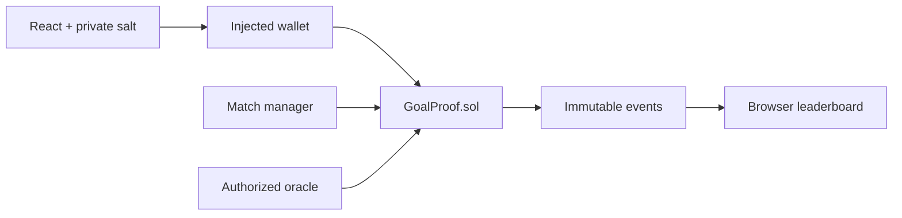

# GoalProof

GoalProof is a non-financial World Cup prediction reputation app. It proves that a hidden score prediction existed before kickoff, then verifies and scores the prediction after an authorized oracle publishes the result.

It is a complete blockchain course MVP: Solidity state machine, 80 automated tests, deterministic local demo, wallet-connected React UI, recovery-safe commit–reveal flow, event-derived leaderboard, admin/oracle operations, gas evidence, and security documentation.

## Why blockchain?

A normal public prediction leaks the answer. A private centralized record asks users to trust its operator not to rewrite timestamps or content. GoalProof publishes an immutable commitment before kickoff without publishing the score itself. Later, the original score and secret salt reproduce the commitment on-chain and settle points deterministically.



## Technology

- Node.js 22.13+ and pnpm 9
- Solidity 0.8.28, Hardhat 3, OpenZeppelin Contracts 5
- React 19, Vite 7, wagmi 3, viem 2, TanStack Query
- Mocha/Chai contract tests and Vitest frontend tests

## Quick start

Install once:

```bash
pnpm install
```

Start a local chain in terminal 1:

```bash
pnpm node
```

Deploy and seed four demo fixtures in terminal 2:

```bash
pnpm deploy:localhost
pnpm seed:localhost
```

Start the app in terminal 3:

```bash
pnpm frontend:dev
```

Open `http://127.0.0.1:5173`, add the Hardhat network (`31337`, `http://127.0.0.1:8545`) to an injected wallet, and import only the printed local development accounts. Never use those public development keys on a real network.

When the local node restarts its state is erased. Redeploy and seed again; otherwise the UI intentionally shows “contract not found.”

## Deterministic CLI proof

With the local node running:

```bash
pnpm demo:localhost
```

The script deploys an isolated demo contract, commits three hidden predictions, advances chain time, submits 2–0, reveals, asserts Alice = 5, Bob = 3, Charlie = 0, and prints gas usage. It exits non-zero on a failed assertion.

For the browser recording flow, `pnpm time:localhost` advances the local chain by 400 seconds after Alice and Bob commit.

## Scoring and timing

| Prediction | Points |
|---|---:|
| Exact score | 5 |
| Correct win/draw/loss outcome | 3 |
| Wrong outcome | 0 |

- Commit: `block.timestamp < commitDeadline`
- Result: `block.timestamp >= kickoffTime`
- Reveal: result submitted and `block.timestamp <= revealDeadline`

The commitment is `keccak256(abi.encode(chainId, contractAddress, wallet, matchId, homeScore, awayScore, salt))`. The score and salt are never stored on-chain during commit.

## Quality commands

```bash
pnpm check                 # compile, root TS, 62 contract tests, frontend TS/lint, 18 tests, build
pnpm contracts:coverage    # 98.29% line / 98.04% statement coverage
pnpm contracts:gas         # writes docs/gas-report.json
pnpm export:abi            # refreshes frontend ABI after contract changes
```

## Environment

Copy `.env.example` only for Sepolia deployment. Copy `frontend/.env.example` to override the public RPC, chain ID, contract address, or deployment block. Never put private keys in frontend variables.

Sepolia is configured but optional:

```bash
pnpm deploy:sepolia
```

No public address is included because this delivery did not receive deployment credentials or faucet ETH.

## Repository map

- `contracts/GoalProof.sol` — roles, fixtures, commit–reveal, settlement, counters, pause
- `test/` — 62 contract tests and full integration proof
- `scripts/` — seed, demo, ABI export, time advance, gas snapshot
- `frontend/` — complete wallet UI and 18 pure-module tests
- `docs/ARCHITECTURE.md` — components and data flow
- `docs/SECURITY.md` — threat model and trust assumptions
- `docs/DEMO_SCRIPT.md` — stable classroom recording flow
- `DECISIONS.md` — compatibility and scope trade-offs

## Known limitations and future work

- The oracle and admin are trusted roles; production should use stronger governance and a decentralized data source.
- Browser local storage is a convenience, not secure custody. Losing the salt prevents reveal.
- Event scans are suitable for a classroom dataset, not high-volume production indexing.
- Fixtures are simulated and are not official tournament claims.
- ERC-1155 reputation badges and a funded Sepolia deployment remain optional extensions.
- This code has automated tests and a manual threat review but no third-party audit.

## Suggested team roles

- Smart contract and test engineering
- Frontend and wallet integration
- Demo/data operations and security review
- Presentation and documentation

This project contains no wagering, deposits, prize pool, token, or real-money transfer logic.
