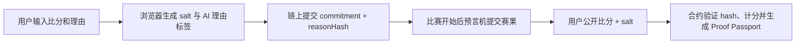

# GoalProof：AI 时代的可验证预测声誉系统

GoalProof 是一个区块链课程项目，用世界杯比分预测作为演示场景，展示 `commit–reveal`（先承诺、后公开）机制如何解决 AI 时代的预测可信度问题。它不是投注平台，也没有代币、奖池或真钱转账；它要解决的是：

> 人和 AI 都可以事后改口、删帖或补写理由。我们如何证明某个预测和它的理由，在事件发生前就已经真实存在？

普通网页可以让服务器保存预测，但大家必须相信服务器没有偷偷改时间或改内容。普通 AI 可以生成很漂亮的分析理由，但很难证明这些理由不是赛后补写的。GoalProof 把“预测承诺”和“理由哈希”写到链上，链上记录不可篡改；等赛果出来后，用户公开原预测和随机盐，合约自动验证并计分，前端生成一张 Proof Passport 可验证预测证明卡。

## 为什么做

预测变得越来越便宜：AI、KOL、专家都能快速生成判断。但可信预测变得更稀缺，因为预测失败后可以删帖、改口，预测成功后又可以包装成“我早就说过”。这个问题很适合区块链：

- 区块链擅长记录不可篡改的时间和证据。
- commit–reveal 可以先隐藏答案，避免提前泄露。
- reasonHash 可以证明预测理由赛前存在，但不公开明文理由。
- AI 可以帮助用户在提交前接受反方质询，赛后做复盘。

## 前人方案的局限与本项目创新

| 方案               | 优点                       | 局限                                         | GoalProof 的改进                       |
| ------------------ | -------------------------- | -------------------------------------------- | -------------------------------------- |
| 区块链慈善捐款系统 | 很好地利用透明性追踪资金流 | 主要解决资金流向，不解决隐藏信息和赛前承诺   | 我们聚焦“先隐藏、后证明”的信息可信问题 |
| 新年目标打卡合约   | 智能合约自动奖惩，机制完整 | 依赖现实目标验证，押金机制带来金融和伦理风险 | 我们不押金、不投注，只积累声誉         |
| 普通公开预测       | 简单直接                   | 提前泄露答案，容易被抄袭或影响他人           | commit 阶段只上链哈希                  |
| 中心化预测平台     | 体验好                     | 用户必须相信平台不会改时间戳或改内容         | 承诺时间和内容指纹由区块链记录         |
| 普通 AI 预测       | 理由丰富                   | 难证明理由不是赛后补写                       | reasonHash 赛前上链，Reveal 后可验证   |

本项目的创新点可以概括为一句话：

> 区块链负责“不可篡改的时间和证明”，AI 负责“质询、解释和复盘”，两者共同形成可验证预测声誉。

## 一句话理解流程



Commit 阶段链上只看到两串 `bytes32` 哈希：一个证明比分预测，一个证明预测理由；看不到明文比分和理由。Reveal 阶段用户拿出原比分和 salt，合约重新计算哈希；如果和当初链上记录一致，就证明这个预测确实提前存在。

## 项目包含什么

- Solidity 合约：比赛创建、预测承诺、赛果提交、公开验证、自动计分、权限控制、暂停机制。
- React 前端：连接 MetaMask/Rabby，本地创建比赛、提交预测、公开预测、查看排行榜。
- AI 小创新：本地 AI 风格预测理由分析、反方质询、赛后复盘，并用链上 `reasonHash` 证明理由在赛前已经存在。
- Proof Passport：Reveal 成功后生成可验证预测证明卡，展示钱包、预测、赛果、得分、commitment、reasonHash 和 AI 复盘。
- 本地演示链：Hardhat Local，不需要真实 ETH。
- 自动化测试：合约测试、前端测试、跨前后端哈希一致性测试。
- 演示脚本：可以一键跑完整 Alice/Bob 预测流程。

## 技术栈

- Node.js `>= 22.13`
- pnpm `9.x`
- Solidity `0.8.28`
- Hardhat 3
- OpenZeppelin Contracts 5
- React 19 + Vite 7
- wagmi + viem
- MetaMask 或 Rabby 钱包插件

如果电脑还没有 pnpm，可以先运行：

```powershell
corepack enable
corepack prepare pnpm@9.3.0 --activate
```

## 目录结构

```text
.
├─ contracts/              # 智能合约
│  └─ GoalProof.sol
├─ test/                   # 合约测试
├─ ignition/modules/       # Hardhat Ignition 部署模块
├─ scripts/                # 本地演示、授权、导出 ABI、gas 报告脚本
├─ shared/                 # 前后端共用的演示数据和计分逻辑
├─ frontend/               # React 前端
│  └─ src/
│     ├─ abi/              # 前端使用的合约 ABI
│     ├─ components/       # 钱包按钮、提交/公开面板等
│     ├─ hooks/            # 读取比赛、排行榜、个人历史
│     ├─ lib/              # 哈希、AI 理由分析、salt 存储、阶段判断、错误提示
│     └─ pages/            # 首页、比赛、排行榜、个人页、管理页
├─ docs/                   # 架构、安全、测试、演示说明
├─ DECISIONS.md            # 关键技术取舍
└─ docs/archive/GOALPROOF_DEVELOPMENT_SPEC.md  # 原始课程项目设计规格（归档）
```

生成目录如 `node_modules/`、`frontend/dist/`、`coverage/`、`types/`、`artifacts/` 都已放进 `.gitignore`，不需要提交。

说明：`docs/archive/GOALPROOF_DEVELOPMENT_SPEC.md` 是开发前的原始长规格，给需要追溯需求的人看；小组成员上手时优先读本 README。

## 第一次运行：本地完整启动

先安装依赖：

```powershell
pnpm install
```

然后开三个终端。

终端 1：启动本地区块链。

```powershell
pnpm node
```

这个终端会打印很多 Hardhat 测试账号。它们只用于本地开发，千万不要在真实网络使用。

终端 2：部署合约并注入 4 场演示比赛。

```powershell
pnpm setup:localhost
```

如果想分开执行，也可以：

```powershell
pnpm deploy:localhost
pnpm seed:localhost
```

终端 3：启动前端。

```powershell
pnpm frontend:dev
```

浏览器打开：

```text
http://127.0.0.1:5173/
```

## 配置 MetaMask

本项目默认连接 Hardhat Local。

在 MetaMask 里添加网络：

| 字段     | 填写                    |
| -------- | ----------------------- |
| 网络名称 | Hardhat Local           |
| RPC URL  | `http://127.0.0.1:8545` |
| Chain ID | `31337`                 |
| 货币符号 | `ETH`                   |

### 方式一：导入 Hardhat 测试账号

`pnpm node` 终端会打印账号和私钥。导入 Account #0 最省事，因为它默认拥有：

- 10000 个本地测试 ETH
- 比赛管理员权限
- 预言机权限
- 暂停员权限

这些私钥是公开开发私钥，只能在本地链用。

### 方式二：给自己的 MetaMask 地址授权

如果想用自己已有的 MetaMask 地址，在终端 2 运行：

```powershell
$env:TARGET_ADDRESS='你的钱包地址'; pnpm grant:localhost; Remove-Item Env:\TARGET_ADDRESS
```

这个脚本会给该地址：

- 转 10 个本地测试 ETH
- 授予比赛管理员、预言机、暂停员三个角色

刷新页面后，管理页顶部应该显示：

```text
比赛管理员 ✓
预言机 ✓
暂停员 ✓
```

## 页面怎么用

前端现在内置了三类导览：

- 首页的 `DEMO ROUTE`：告诉第一次演示应该按哪 5 步走。
- 比赛页和管理页的流程条：区分普通用户流程和演示者/预言机流程。
- 比赛详情页的 `NEXT STEP`：根据当前钱包、比赛阶段和链上状态，提示你下一步该做什么。
- 空状态行动卡片：没有比赛、没有记录、没有权限时，会直接给出“去比赛页 / 去管理页”的按钮。

如果不知道去哪，优先看页面顶部的流程条和 `NEXT STEP` 提示。

### 推荐使用顺序

1. 管理员或演示者进入管理页，创建一场未来开赛的比赛。
2. 普通用户进入比赛页，选择可提交预测的比赛。
3. 在比赛详情页跟着 `NEXT STEP` 完成 Commit。
4. 比赛开赛后，演示者回到管理页提交赛果。
5. 普通用户回到比赛详情页跟着 `NEXT STEP` 完成 Reveal。
6. 查看 Proof Passport、排行榜和个人页。

### 比赛页

这是普通预测用户的入口。页面会显示当前链上比赛列表，并用流程条提示：

```text
连接钱包 → 选择比赛 → 提交 Commit → 公开 Reveal
```

每场比赛会根据链上时间显示阶段：

- 可提交预测
- 等待赛果
- 可公开预测
- 已结束
- 已取消

### 比赛详情页

普通用户在这里完成 commit–reveal。页面中部会显示 `NEXT STEP`，直接告诉你当前应该连接钱包、提交预测、等待赛果还是公开预测。

1. 在 Commit 阶段输入比分。
2. 写下预测理由，前端会在本地做 AI 风格标签分析，例如“进攻状态”“伤病停赛”“风险：均衡”。
3. 浏览器生成随机 salt，并保存到本机 localStorage。
4. 钱包签名交易，链上只保存比分 commitment 和理由 reasonHash。
5. 赛果提交后，用户 Reveal 原比分和 salt。
6. 合约验证成功后自动计分，前端根据赛果展示 AI 赛后复盘和 Proof Passport。

重要：如果清空浏览器数据，salt 和明文预测理由可能丢失。提交预测后建议导出恢复文件。

### 管理页

这是演示者、管理员和预言机用的页面，不是普通预测用户的起点。页面会用 `OPERATOR FLOW` 提醒演示顺序：

```text
检查角色 → 创建比赛 → 让用户预测 → 提交赛果
```

管理页用于：

- 创建比赛
- 提交最终赛果
- 取消比赛
- 暂停/恢复合约写操作

这些权限最终由 Solidity 合约判断，前端只是辅助显示。

### 排行榜和个人页

排行榜由链上事件计算，不在合约里循环排序。个人页可以查看某个地址的历史提交和得分情况。

## 课堂演示推荐流程

1. 管理员创建一场未来开赛的比赛。
2. 切换到 Alice 钱包，提交 `2:0` 预测。
3. 切换到 Bob 钱包，提交 `3:1` 预测。
4. 等待或运行下面命令推进本地链时间：

```powershell
pnpm time:localhost
```

5. 预言机提交真实赛果 `2:0`。
6. Alice Reveal，得到 5 分。
7. Bob Reveal，猜中胜负但比分不完全一致，得到 3 分。
8. 打开 Proof Passport、排行榜和个人页展示结果。

也可以直接运行命令行完整演示：

```powershell
pnpm demo:localhost
```

这个脚本会部署一个独立演示合约，模拟 Alice/Bob/Charlie 的预测、推进时间、提交赛果、公开并校验分数。

## 计分规则

| 情况                               | 分数 |
| ---------------------------------- | ---: |
| 比分完全正确                       |    5 |
| 胜/平/负结果正确，但比分不完全正确 |    3 |
| 结果错误                           |    0 |

例子：真实赛果是 `BRA 2 : 0 ARG`。

- 预测 `2 : 0` 得 5 分。
- 预测 `3 : 1` 得 3 分，因为都表示主队赢。
- 预测 `1 : 1` 得 0 分。

## 核心合约设计

合约 `GoalProof.sol` 是系统唯一可信状态机。它负责：

- 角色权限：管理员、预言机、暂停员
- 比赛生命周期：创建、取消、开赛、截止
- 预测承诺：每个地址每场比赛只能 commit 一次
- 理由证明：可选使用 `commitPredictionWithReason` 同时提交预测理由哈希
- 赛果提交：预言机提交后不可修改
- 公开验证：重新计算 commitment 并比对
- 自动计分：Reveal 成功时立即写入积分

commitment 计算方式：

```text
keccak256(
  abi.encode(
    chainId,
    contractAddress,
    walletAddress,
    matchId,
    predictedHomeScore,
    predictedAwayScore,
    salt
  )
)
```

把 `chainId`、合约地址和钱包地址一起编码，是为了防止同一个哈希被复制到别的链、别的合约或别的钱包里复用。

reasonHash 计算方式：

```text
keccak256(
  abi.encode(
    chainId,
    contractAddress,
    walletAddress,
    matchId,
    normalizedReason
  )
)
```

这里的 “AI” 不调用外部大模型 API，而是一个本地可解释的分析器：它根据关键词把预测理由整理成标签、风险等级、反方质询和复盘焦点。这样课堂演示不依赖网络或 API Key，同时仍然体现 AI + 区块链的结合：AI 帮助用户形成可复盘的判断，区块链证明这个判断在赛前已经存在。

## 常用命令

| 命令                      | 作用                          |
| ------------------------- | ----------------------------- |
| `pnpm install`            | 安装依赖                      |
| `pnpm node`               | 启动 Hardhat 本地链           |
| `pnpm setup:localhost`    | 部署合约并创建演示比赛        |
| `pnpm frontend:dev`       | 启动前端                      |
| `pnpm grant:localhost`    | 给指定地址本地 ETH 和角色权限 |
| `pnpm time:localhost`     | 推进本地链时间，方便演示      |
| `pnpm demo:localhost`     | 命令行跑完整预测流程          |
| `pnpm check`              | 跑完整质量检查                |
| `pnpm contracts:coverage` | 合约覆盖率                    |
| `pnpm contracts:gas`      | 生成 gas 报告                 |

## 测试和质量

完整检查：

```powershell
pnpm check
```

当前覆盖内容：

- 64 个合约测试
- 24 个前端测试
- 合约编译
- TypeScript 类型检查
- ESLint
- 前端生产构建

合约覆盖率可运行：

```powershell
pnpm contracts:coverage
```

gas 报告可运行：

```powershell
pnpm contracts:gas
```

报告输出在 `docs/gas-report.json`。

## 常见问题

### 1. 点击连接钱包没反应

确认 Chrome 里安装并启用了 MetaMask 或 Rabby。刷新页面后再点连接。前端会提示当前浏览器是否检测到钱包插件。

### 2. MetaMask 显示 0 ETH

你可能连的是自己的空账号。可以导入 Hardhat 本地账号，或用：

```powershell
$env:TARGET_ADDRESS='你的钱包地址'; pnpm grant:localhost; Remove-Item Env:\TARGET_ADDRESS
```

### 3. 管理页不能创建比赛

检查三件事：

- MetaMask 网络是否是 Hardhat Local。
- 当前地址是否显示 `比赛管理员 ✓`。
- 比赛时间是否在未来，并且满足：承诺截止 < 开赛时间 < 公开截止。

### 4. 页面提示当前地址没有合约

本地链重启后状态会清空，需要重新部署：

```powershell
pnpm setup:localhost
```

### 5. 预测后无法 Reveal

Reveal 需要当初的 salt。如果浏览器数据被清空，需要导入之前导出的恢复文件。没有 salt 就无法证明原预测；没有恢复文件里的预测理由，也无法在前端展示完整 AI 复盘。

### 6. Reveal 提示链上没有承诺

如果看到 `PredictionNotCommitted` 或“链上未找到承诺”，说明当前钱包在当前这条本地链、当前合约、当前比赛下没有成功提交过 Commit。常见原因是：

- 本地 Hardhat 链重启过，但没有重新 `pnpm setup:localhost` 和重新提交预测。
- 当前 MetaMask 钱包不是当初提交预测的钱包。
- 导入了旧部署或旧钱包生成的恢复文件。
- Commit 交易当时没有确认成功。

解决办法是切回正确钱包；如果本地链重启过，就重新部署、重新创建/选择比赛并重新 Commit。

### 7. 为什么不用真实世界杯数据？

这是课程演示项目。真实数据源会引入额外 oracle 设计和可信问题，所以当前版本使用授权预言机手动提交赛果，并在文档中明确这是 MVP 限制。

## 项目边界

本项目明确不包含：

- 押注
- 赔率
- 奖池
- 充值/提现
- 代币发行
- NFT 奖励
- 真实赛事数据声明
- 外部 AI API 调用

它的重点是展示：如何用链上不可篡改记录 + commit–reveal 机制解决“提前预测但不提前公开”的问题，并加入一个可解释、离线可演示的 AI 预测理由复盘层。

## 更多文档

- `docs/ARCHITECTURE.md`：系统架构和数据流。
- `docs/SECURITY.md`：安全假设和风险。
- `docs/TEST_PLAN.md`：测试计划。
- `docs/DEMO_SCRIPT.md`：课堂录屏/展示脚本。
- `DECISIONS.md`：关键技术取舍记录。

## 小组分工建议

- 合约同学：讲 `GoalProof.sol`、权限、commit–reveal 和测试。
- 前端同学：讲钱包连接、首页对比叙事、AI 理由卡片、Proof Passport、salt 恢复文件。
- 演示同学：负责本地链、MetaMask、创建比赛、提交赛果。
- 汇报同学：讲为什么需要区块链、项目边界和未来改进。

如果只需要演示，不必每个人都懂 Solidity；按照 README 跑通本地流程即可。
