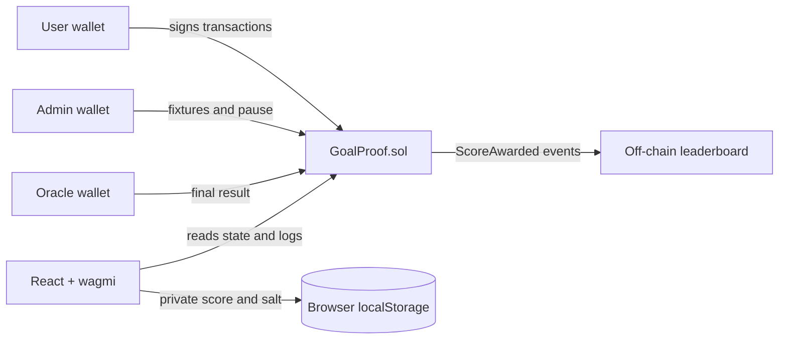
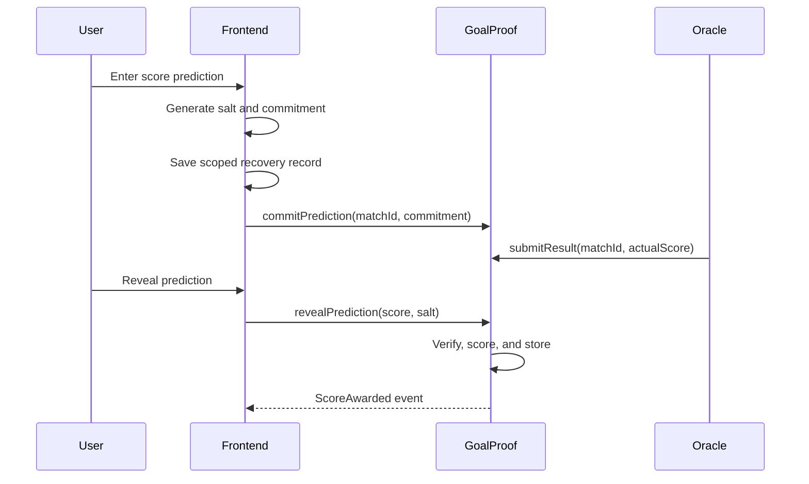

# Architecture

GoalProof is a backend-free pnpm workspace. The smart contract is the authoritative state machine; the React application reads it over JSON-RPC and asks an injected wallet to sign writes.

## Contract boundary

`GoalProof.sol` controls match validity, role authorization, time boundaries, commitment uniqueness, result immutability, reveal verification, points, counters, cancellation, and pause state. It accepts no ETH, makes no external calls, and contains no unbounded user loops.

## Commitment data flow

The commitment uses `keccak256(abi.encode(chainId, contract, user, matchId, homeScore, awayScore, salt))`. Chain, contract, and wallet domain separation prevents copying or reusing a commitment elsewhere.

## Frontend modules

- `lib/commitment.ts`: canonical viem encoding and cryptographic salt generation.
- `lib/saltStorage.ts`: validation, scoped storage, recovery export/import.
- `lib/phases.ts`: deterministic UI state from chain timestamps.
- `hooks/useLeaderboard.ts`: event query and deterministic ranking.
- pages: home, fixtures, prediction detail, leaderboard, profile, and role-gated operations.
