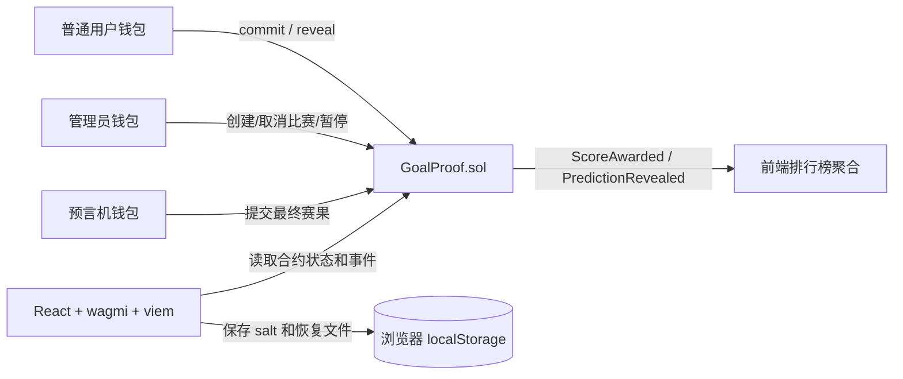
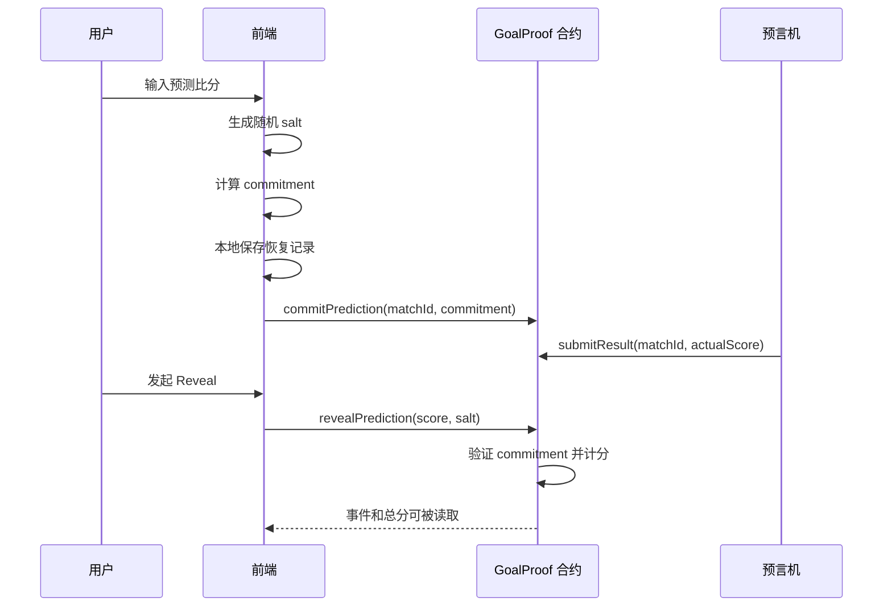

# GoalProof 架构说明

GoalProof 是一个“无后端”的本地优先 DApp。系统没有数据库服务器，也没有传统后端 API；智能合约是唯一可信状态机，前端通过 JSON-RPC 读取链上状态，并通过钱包发起写交易。

## 总体结构



设计取舍：

- 合约负责所有关键规则，前端只负责展示和交易发起。
- 不接收 ETH，不发行代币，不做投注。
- 排行榜不在合约内排序，避免链上循环和高 gas。
- 预测 salt 只保存在用户浏览器本地，永远不在 commit 阶段上链。

## 合约边界

`contracts/GoalProof.sol` 负责：

- 角色权限：`MATCH_MANAGER_ROLE`、`ORACLE_ROLE`、`PAUSER_ROLE`
- 比赛生命周期：创建、取消、开赛、commit 截止、reveal 截止
- commit 约束：每个地址每场比赛只能提交一次哈希
- result 约束：预言机只能在开赛后提交一次最终赛果
- reveal 验证：重新计算 commitment，检查是否匹配
- 自动计分：exact score 5 分，正确胜平负 3 分，错误 0 分
- 暂停机制：紧急情况下阻止写操作

合约不做：

- 不存储所有用户列表
- 不排序排行榜
- 不调用外部合约
- 不接收或转出资金

## Commit–Reveal 数据流



commitment 公式：

```text
keccak256(
  abi.encode(
    chainId,
    contractAddress,
    walletAddress,
    matchId,
    predictedHomeScore,
    predictedAwayScore,
    salt
  )
)
```

这里把链 ID、合约地址和钱包地址一起编码，是为了做“域隔离”：同一个预测不能被复制到别的链、别的合约或别的钱包里冒用。

## 前端模块

```text
frontend/src/
├─ abi/                  # 合约 ABI
├─ components/           # 钱包、交易状态、Commit/Reveal 面板
├─ config/               # 链 ID、RPC、合约地址、wagmi 配置
├─ hooks/                # 读取比赛、排行榜、个人历史
├─ lib/
│  ├─ commitment.ts      # commitment 编码和 salt 生成
│  ├─ saltStorage.ts     # 本地 salt 保存、导出、导入
│  ├─ phases.ts          # 比赛阶段判断
│  ├─ leaderboard.ts     # 事件聚合排行榜
│  ├─ gas.ts             # 写交易 gas 上限
│  └─ errors.ts          # 用户友好的错误提示
└─ pages/                # 首页、比赛、详情、排行榜、个人页、管理页
```

前端没有保存任何中心化数据库。所有公共状态来自链上；用户私有的 salt 只留在本机浏览器里。

## 脚本模块

```text
scripts/
├─ seed-demo.ts              # 注入演示比赛
├─ grant-local-operator.ts   # 给本地钱包转 ETH 并授予角色
├─ demo-flow.ts              # 命令行完整演示流程
├─ advance-time.ts           # 推进本地链时间
├─ gas-snapshot.ts           # 生成 gas 报告
└─ export-abi.ts             # 导出 ABI 到前端
```

课堂演示主要用：

- `pnpm setup:localhost`
- `pnpm grant:localhost`
- `pnpm time:localhost`
- `pnpm demo:localhost`

## 失败模式和处理

- 本地链重启：链上状态清空，需要重新 `pnpm setup:localhost`。
- 钱包没本地 ETH：用 `pnpm grant:localhost` 给地址转测试 ETH。
- 没管理员权限：管理页会显示角色不是 `✓`，同样用授权脚本处理。
- salt 丢失：无法 reveal，需要导入之前导出的恢复文件。
- 比赛时间填错：前端会先校验，合约也会再次拒绝。

## 为什么不加传统后端

课程项目的核心目标是展示链上承诺、链上验证和链上计分。如果加入数据库后端，会把信任边界变复杂，反而削弱 commit–reveal 的教学重点。当前架构更适合课堂演示：本地链、钱包、合约、前端四个部分足够完整，也足够可解释。
